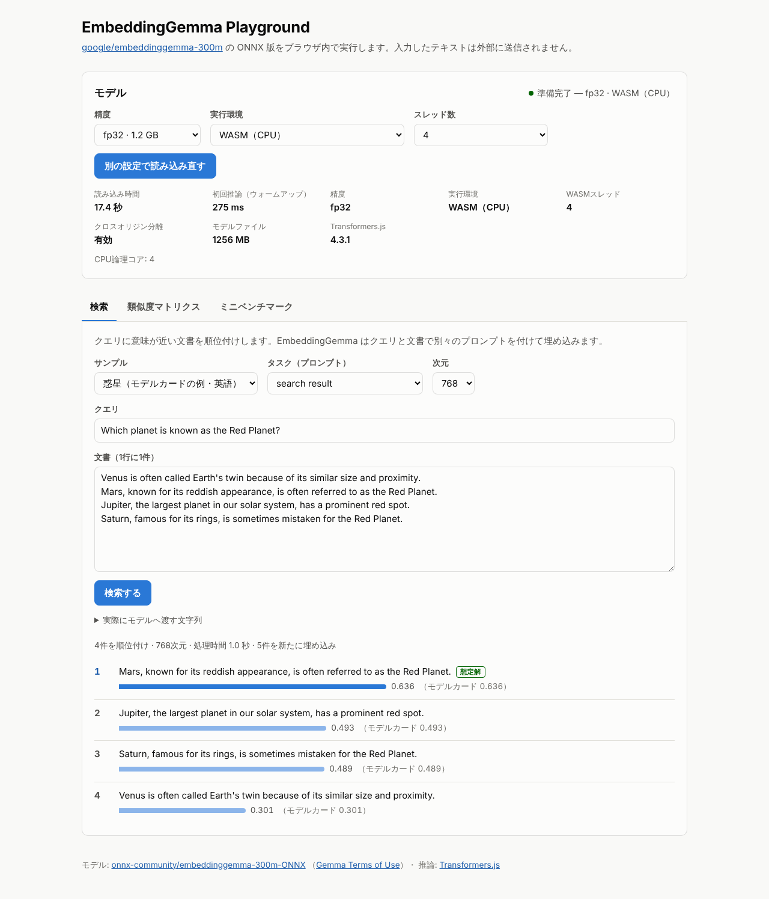

# EmbeddingGemma Playground

[google/embeddinggemma-300m](https://huggingface.co/google/embeddinggemma-300m) の ONNX 版
（[onnx-community/embeddinggemma-300m-ONNX](https://huggingface.co/onnx-community/embeddinggemma-300m-ONNX)）を
[Transformers.js](https://huggingface.co/docs/transformers.js) でブラウザ内実行し、性能を確かめるためのデモです。
推論はすべてブラウザ内で行われ、入力テキストは外部に送信されません。

Playwright で画面を実際に操作する E2E 検証も同梱しています。測定結果は
[docs/results-2026-10-07.md](docs/results-2026-10-07.md) にまとめました。

jev-ultrafast の Jev（次の操作を選ぶ判断役）を EmbeddingGemma に置き換えたブラウザエージェントも入っています
（下の「Gemma ブラウザエージェント」）。



## できること

| タブ | 内容 |
| --- | --- |
| 検索 | クエリに近い文書を順位付け。タスク別プロンプト、MRL 次元（768/512/256/128）を切り替え可能。サンプルは想定解に「想定解」バッジが付くので外れがすぐ分かる |
| 類似度マトリクス | 複数文のコサイン類似度をヒートマップ表示。日英の言い換えがまとまるかを確認 |
| ミニベンチマーク | 日英の小さな検索データセット（文書63件・クエリ56件、紛らわしい文書入り）で Top-1 / Recall@5 / MRR@10 / nDCG@10 と速度を測定。プロンプト有無 × 次元の比較、言語ペア別、外したクエリの一覧、JSON 保存 |

モデルパネルでは精度（fp32 / q8 / q4）、実行環境（WASM / WebGPU）、WASM のスレッド数を選べます。

## 使い方

Node.js 20 以上が必要です。デモ本体は依存パッケージなしで動きます（Transformers.js は jsDelivr から読み込みます）。

```bash
cd embeddinggemma-demo
npm start            # http://127.0.0.1:5173/
```

ブラウザで開いて「モデルを読み込む」を押すと、Hugging Face Hub からモデルを取得します（初回のみ。以降はブラウザのキャッシュを使います）。

`npm start` のサーバーは COOP/COEP ヘッダーを付けて配信するため、WASM がマルチスレッドで動きます。
`python -m http.server` などで `public/` を配信しても動きますが、その場合は 1 スレッドになり遅くなります。

### モデルを手元に置く（任意）

```bash
npm run download-model                 # q8 + q4（約 530 MB）
npm run download-model -- fp32 q8 q4   # 全部（約 1.8 GB）
```

`models/` に保存したファイルはサーバーが `/models/` で配信し、ブラウザはそちらを優先して読み込みます（無ければ Hub から取得）。
プロキシ環境では `NODE_USE_ENV_PROXY=1 npm run download-model` のように実行してください（Node 22.21 以降）。

### 精度と実行環境の選び方

| 精度 | サイズ | WASM（CPU）での傾向 |
| --- | ---: | --- |
| fp32 | 1.26 GB | 精度はモデルカード通り。WASM では一番速い。ダウンロードが重い |
| q8 | 331 MB | fp32 とほぼ同じ精度。単発クエリは fp32 の約2倍の時間 |
| q4 | 217 MB | 一番小さいが WASM では一番遅く、精度もわずかに落ちる |

- モデルカードの注意書きどおり、EmbeddingGemma は fp16 の活性値に対応していないため fp16 / q4f16 は選択肢から外しています。
- q4 は `model_no_gather_q4.onnx` を使います（通常の `model_q4.onnx` は WASM が未対応の `GatherBlockQuantized` を含むため）。
- WebGPU は対応ブラウザでのみ選択できます。この環境（GPU なしのヘッドレス Chromium）では未検証です。

### URL パラメータ

| パラメータ | 例 | 意味 |
| --- | --- | --- |
| `dtype` | `?dtype=fp32` | 精度の初期値 |
| `device` | `?device=webgpu` | 実行環境の初期値 |
| `threads` | `?threads=4` | WASM スレッド数の初期値 |
| `autoload` | `?autoload=1` | 開いたらすぐ読み込む |
| `cache` | `?cache=0` | Cache Storage にモデルを保存しない |
| `local` | `?local=0` | `/models/` を見ずに Hub から取得する |

## E2E 検証（Playwright）

```bash
npm install                      # @playwright/test のみ
npx playwright install chromium  # 初回のみ
npm run download-model -- fp32 q8 q4

npm test                                        # 評価指標の単体テスト（node:test）
DTYPES=fp32,q8,q4 THREADS=4 npm run test:e2e    # 既定は DTYPES=q8, THREADS=auto
npm run report                                  # test-output/REPORT.md を生成
```

精度ごとに 1 つのページでモデルを読み込み、ユーザーと同じ操作で次を確認します。

1. 初期表示（モデル未読み込みでボタンが無効、クロスオリジン分離が有効、タブのキーボード操作）とスマホ幅で横スクロールが出ないこと
2. UI からモデルを読み込めること
3. モデルカードの例を再現できること（順位が一致し、スコア差が fp32 0.005 / q8 0.03 / q4 0.05 未満）
4. 日本語 FAQ と日→英の検索で想定解が 1 位になること（アニメ制作の例は全精度で 3 位になる既知の外れのため、順位を記録のみ）
5. 768 / 512 / 256 / 128 次元のどれでも FAQ の想定解が 1 位で、2 回目以降は埋め込みキャッシュが再利用されること
6. 類似度マトリクスで「同じ意味の組の最小値 > 違う意味の組の最大値」になること、ツールチップが出ること
7. ミニベンチマークが完走し（Top-1 > 0.6、MRR@10 > 0.7 の下限チェック）、JSON を保存できること

スクリーンショットと数値は `test-output/`（git 管理外）に出力されます。

## 操作動画の録画

E2E とは別に、人が見る用の操作動画（字幕・カーソル・クリック表示つき、1280×720 の MP4）を録画できます。
モデルの読み込み待ちはカットするか早送り（4 倍速以上、1 回あたり最大 5 秒）にします。MP4 への変換には libx264 入りの ffmpeg が必要です（無ければ WebM のまま残します）。

```bash
npm run download-model -- fp32 q8 q4
npm run record                            # 全シナリオ → test-output/videos/*.mp4
npm run record -- similarity benchmark    # 指定したシナリオだけ
```

| シナリオ | 内容 |
| --- | --- |
| `load-and-search` | モデルを UI から読み込み、モデルカードの例を検索。768 → 128 次元に減らして再検索 |
| `japanese-search` | FAQ に言い回しを変えた質問を入力（当たる例と外れる例） |
| `cross-lingual-and-miss` | 日本語クエリで英語文書を検索。アニメ制作用語で外れる例 |
| `similarity` | 類似度マトリクスを計算し、セルをホバー。英文を 1 行足して再計算 |
| `precision` | q8 → fp32 → q4 と読み込み直し、モデルカードの値との差を比べる |
| `benchmark` | ミニベンチマークを実行し、結果を順に見る |

字幕の数値はその場の結果から作るので、結果が変わっても字幕と画面が食い違いません。録画中は CPU を録画にも使うため、速度の数値は参考程度にしてください。

## Gemma ブラウザエージェント（Jev の代わりに Gemma）

[jev-ultrafast](https://github.com/browser-use/jev-ultrafast)（Browser Use）と同じ流れのブラウザエージェントです。
TypeSafe の Jev が担う「次に操作する要素と、操作の種類を選ぶ」役を EmbeddingGemma に置き換えています。

```
ページ ─▶ 番号付きの要素表（agent/browser.js の snapshot）
      ─▶ 候補: CLICK / TYPE_TEXT / SELECT / CHECK / DONE（agent/actions.mjs）
      ─▶ EmbeddingGemma が「手順の文」と各候補の類似度を確率にして 1 つ選ぶ（Jev の役）
      ─▶ Playwright が実行 ─▶ 最後にタスクごとの検証で結果を確かめる
```

| 役割 | jev-ultrafast | このデモ |
| --- | --- | --- |
| 次の操作と対象を選ぶ | Jev（TypeSafe） | EmbeddingGemma 300M（Node + onnxruntime、CPU） |
| 手順（サブゴール） | Jev がゴールから直接判断。jev-mcp では Claude Code などが指示 | `--planner script`（既定）: タスクに書いた手順（Claude が作成）<br>`--planner gemma4`: Gemma 4 E2B がページごとに作成 |
| 入力する文字列 | 小型 LLM が書く | 手順中の「」の文字列（`gemma4` では Gemma 4 が書く） |
| 完了（DONE） | Jev の DONE ＋ 独立した検証 | タスクごとの検証（`gemma4` では Gemma 4 に「はい/いいえ」を聞く） |
| ブラウザ操作 | Browser Harness（CDP） | Playwright |

画面の右側に、計画・各ステップの候補と確率・判断時間を出すインスペクターが付きます。

```bash
npm install                        # .npmrc で onnxruntime-node の CUDA 用ダウンロードを省略
npm run download-model -- fp32     # EmbeddingGemma（fp32）
npm run agent                      # 6 タスクを実行（手順書 + EmbeddingGemma）
npm run agent -- --video           # test-output/agent/videos/*.mp4 も録画
npm run agent -- --decider gemma4  # 判断役を Gemma 4 E2B にして比較（初回に約 3.6 GB をダウンロード）
npm run agent -- --planner gemma4  # 手順も Gemma 4 E2B が作る（完全ローカル）
```

タスクは、宿泊予約（検索 → 絞り込み → 並べ替え）、通販（先月の注文の領収書、商品検索 → 並べ替え）、
アカウント設定（スイッチとプルダウンを変えて保存、「アカウントを削除」ボタンあり）をモックサイト（`public/sites/`）で 5 つ、
実サイトの日本語版ウィキペディアで 1 つです。手順書はあえて画面のラベルと違う言い方で書いています
（例: 「画面を暗い配色にする」→ テーマ「ダーク」、「大人の人数を2人にする」→ 大人「2名」）。

### 結果（4 コア CPU のクラウド環境）

| 手順を書く役 | 判断役（Jev の役） | 成功 | 1 回の判断（中央値 / 最大） | 計画・完了判定（Gemma 4 E2B） |
| --- | --- | --- | --- | --- |
| 手順書（Claude が作成） | **EmbeddingGemma 300M** | **6/6** | 0.1 秒 / 3.1 秒 | — |
| 手順書（Claude が作成） | Gemma 4 E2B | 3/6 | 7.4 秒 / 59 秒 | — |
| Gemma 4 E2B | EmbeddingGemma 300M | 3/6 | 0.15 秒 / 2.9 秒 | 計画 1 回 16〜44 秒（中央値 24 秒）<br>完了判定 1 回 5〜16 秒（中央値 9 秒） |

- 判断の最大値は、要素が約 150 個あるウィキペディアのページを初めて見たときです（候補をすべて埋め込むため。同じ文はキャッシュします）。
- 判断役を Gemma 4 E2B にした行では、EmbeddingGemma と同じ情報（手順と候補の表）だけを渡しています。
  「検索を実行する」で検索ボタンではなく入力欄を選ぶ（宿泊予約・ウィキペディア）、
  「2026年9月の注文の領収書を出す」で先頭の 10 月の注文を選ぶ、の 3 つで失敗しました。
  目標の文も一緒に渡すと 0/6 でした（検索や保存の手順でも、目標に出てくる入力欄やスイッチを選び続けた）。
- Gemma 4 E2B が手順も作る行では、失敗はどれも計画か完了判定によるものでした。
  宿泊予約は最初のページの計画で「1泊」を落とし、領収書は 9 月の領収書ページまで行けたのに「達成していない」と判断して注文履歴へ戻り、そこで「達成した」と判断し、商品検索は並べ替える前に「達成した」と判断しました。
  EmbeddingGemma は、Gemma 4 E2B が書いた手順どおりの要素を毎回選んでいます（間違った手順にもそのまま従います）。
- 手順書は、jev-mcp で Claude Code などが Jev に渡すサブゴールに相当します。目標から手順を作る部分（計画）と、
  終わったかどうかの判断は、2B クラスの生成モデルには荷が重いという結果です。

### 調整の経緯

最初は Gemma 4 E2B に目標から手順をまとめて作らせる構成で 2/6 でした。そこから次の設計変更をしています（特定のタスク向けの調整はしていません）。

- 画面外の要素も候補に入れる（「変更を保存」が画面外にあり、別のボタンを押していた）
- 値を持つ手順は入力・選択・切り替えだけを候補にする（Jev の操作ごとの head と同じ考え方）
- 一度設定した要素は二度設定しない
- Gemma 4 にはページが変わるたびに、いまのページの要素とこれまでの操作を見せて計画し直させ、完了は別の「はい/いいえ」質問にする
- 「先月」を正しく月に直せなかったため、プロンプトに今日・今月・先月・来月を明記する
- 埋め込みを文字数順にまとめて計算する（パディングの無駄が減り、判断が約 5 倍速くなった）

## 構成

```
server.mjs                  静的サーバー（COOP/COEP、/models/ の配信、パストラバーサル防止）
public/index.html           画面
public/app.js               UI ロジック（検索・類似度・ベンチマーク）
public/embedder.worker.js   Web Worker 内で Transformers.js を実行
public/lib/model-config.js  モデル ID・リビジョン固定・プロンプト・精度の定義
public/lib/metrics.js       MRL 切り詰め、コサイン類似度、Top-1 / MRR / nDCG
public/data/benchmark.json  ミニベンチマーク用データセット（手作り）
public/data/presets.js      検索・類似度のサンプル
scripts/download-model.mjs  モデルのダウンロード
scripts/make-report.mjs     E2E 結果の集計
scripts/record-demo.mjs     字幕つき操作動画の録画
scripts/lib/video.mjs       録画の後処理（カット・早送り・MP4 変換）とサーバー起動
agent/run.mjs               Gemma ブラウザエージェント（ループ・インスペクター・録画）
agent/browser.js            ページ内で動く要素表の作成とインスペクター
agent/actions.mjs           候補の作成、値の決め方、Playwright での実行
agent/gemma.mjs             EmbeddingGemma と Gemma 4 E2B（計画・完了判定・比較用の判断役）
agent/tasks.mjs             6 つのタスクと、それぞれの結果の検証
public/sites/               エージェントが操作するモックサイト（宿泊予約・通販・アカウント設定）
tests/unit, tests/e2e       単体テスト、Playwright テスト
```

## ライセンスについて

モデルの重みは [Gemma Terms of Use](https://ai.google.dev/gemma/terms) に従います。
ミニベンチマークのデータセットはこのデモ用に書いたもので、MTEB / JMTEB の代わりにはなりません。
