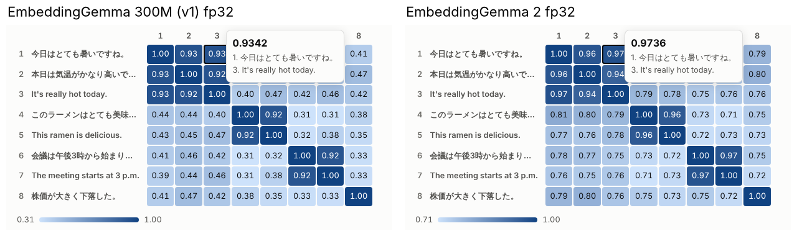

# EmbeddingGemma 2 での再検証（2026-10-08）

初代（EmbeddingGemma 300M）で行った検証を、[EmbeddingGemma 2](https://huggingface.co/google/embeddinggemma-2) でやり直した記録です。

- ブラウザのデモと E2E（検索・類似度・ミニベンチマーク）
- Jev の代わりに EmbeddingGemma を使うブラウザエージェント
- スマホ実行チェック
- 1 文字ずつの文字生成

環境はどれも同じクラウドコンテナ（CPU 4 コア・GPU なし）です。速度は同じ日に初代も測り直し、同じ条件の値を並べています。
使ったのは [onnx-community/embeddinggemma-2-ONNX](https://huggingface.co/onnx-community/embeddinggemma-2-ONNX)（リビジョン `daa72c5`）のテキストモデルと、Transformers.js 4.3.1 です。

## 結論

1. **ブラウザで動くが、CPU で使えるのは fp32（1.1 GB）だけ。**
   画像・音声のエンコーダーを外して、テキスト部分（270M）だけを読み込めます。
   q8・q4 は埋め込み表に GatherBlockQuantized を使うので、ブラウザでは WebGPU が必要です（WASM 版の onnxruntime にこの演算がありません）。
   初代は CPU でも q8（331 MB）が動いたので、WebGPU のない環境では 2 のほうが重くなります。
2. **検索の精度は少し上がった。**
   ミニベンチマークの Top-1 は 96.4% → 98.2%、MRR@10 は 0.982 → 0.991 です。
   初代が外した 2 問（富士山の高さ、関ヶ原）を当てました。q8・q4 でも精度は落ちませんでした。
3. **類似度の値の出方が大きく違う。**
   2 は、無関係な文どうしでも 0.7〜0.8 くらいの類似度を返します。
   同じ意味の組の最小値と違う意味の組の最大値の差は、0.445 から 0.133 に縮みました。
   順位付けには影響しません。ただし「0.5 以上なら関連あり」のようなしきい値は、初代の値を使い回せません。
4. **速度は初代 fp32 の 1.2〜1.3 倍かかる。**
   WASM（4 スレッド）で、文書 1 件 215 ms（初代 168 ms）、検索クエリ 175 ms（初代 145 ms）でした。
5. **エージェントは 6/6 で、21 手すべてで初代と同じ要素を選んだ。**
   ただし 1 位と 2 位の候補の差（中央値）は 0.067 で、初代の 0.165 の約 4 割です。
6. **文字生成は、文章にならない点は同じで、「だまされやすさ」は増した。**
   「猫食べ禁いいの」のように「食べ」「東京」程度の短い語は出るようになりましたが、文章にはなりません。
   質問への「回答」では 3 問とも、意味の通らない文字列が正しい答えの文を大きく上回りました（初代では 1 問だけ）。
   英字 1 字ずつの英文は「,」の 1 字で止まりました。
7. **スマホでは、WebGPU があれば初代より小さく済む。**
   q4 はダウンロード 175 MB で、最大の重みは 67 MB です。WebGPU があれば、ほとんどの端末で動く見込みです。
   WebGPU がない端末では fp32 の 1.1 GB を CPU で動かすことになり、タブのメモリは 2.8 GB でした（初代 q8 は 2.1 GB）。

## 初代との違い

| | 初代（EmbeddingGemma 300M） | EmbeddingGemma 2 |
| --- | --- | --- |
| 公開 | 2025-09 | 2026-09-14 |
| 入力 | テキスト | テキスト・画像・動画・音声 |
| パラメータ | 約 3 億 | 7.4 億（テキスト部分は 2.7 億: Transformer 1.3 億 + 埋め込み表 1.4 億） |
| 層 / 内部の次元 | 24 層 / 768 | 24 層 / 512（出力で 768 に射影） |
| 文脈長 | 2,048 トークン | 8,192 トークン |
| 出力 | 768 次元（MRL で 512 / 256 / 128） | 同じ |
| プロンプト | `task: search result \| query: …` / `title: none \| text: …` など | 同じ |
| トークナイザー | Gemma 3 の 26 万語 | 同じ語彙（違うのは特殊トークンの割り当てだけで、ミニベンチマークの文書のトークン数も同じ） |
| MTEB 多言語 v2 / コード（モデルカード） | 61.15 / 68.76 | 61.36 / 78.68 |
| ライセンス | Gemma Terms of Use | Apache 2.0 |
| ONNX テキストモデル fp32 / q8 / q4 | 1,235 / 309 / 195 MB | 1,085 / 314 / 175 MB |
| 最大の重み（埋め込み表）fp32 / q8 / q4 | 805 / 201 / 101 MB | 537 / 134 / 67 MB |
| ブラウザの CPU（WASM）で動く精度 | fp32・q8・q4（q4 は no_gather 版） | fp32 だけ |

どちらのモデルカードも、活性値が float16 の範囲を超えるので fp16 を使わないよう注意しています。
そのため、ONNX 版にある fp16・q4f16 はデモの選択肢から外しています（2 の ONNX 版の説明には、q4f16 でもテキストの埋め込みは fp32 とのコサイン類似度が最悪 0.988 とありますが、公式の注意に合わせました）。

## 1. ブラウザのデモと E2E

`npm run test:e2e` を初代（fp32・q8・q4）と 2（fp32）で続けて実行し、`npm run report` で集計しました。E2E はすべて成功しています。
2 の q8・q4 はブラウザでは WebGPU が必要で、この環境にはソフトウェア実装の WebGPU しかありません（1 文の埋め込みに約 6 秒）。
そこで、ミニベンチマークの精度は同じ評価コードを Node（onnxruntime・CPU）で動かして測りました（`npm run benchmark`）。
Node 版は、ブラウザで測った 4 通り（初代 3 精度と 2 の fp32）で、全次元・プロンプト有無のすべての値がブラウザと一致しています。

### まとめ（768 次元・プロンプトあり）

| モデル・精度 | ファイル | 読み込み | Top-1 | MRR@10 | nDCG@10 | 文書 ms/件（バッチ 8） | クエリ p50 / p95 |
| --- | ---: | ---: | ---: | ---: | ---: | ---: | ---: |
| 初代 fp32 | 1,256 MB | 20.8 s | 96.4%（54/56） | 0.982 | 0.987 | 168 | 145 / 311 ms |
| 初代 q8 | 331 MB | 6.3 s | 96.4%（54/56） | 0.982 | 0.987 | 214 | 359 / 449 ms |
| 初代 q4 | 217 MB | 4.9 s | 94.6%（53/56） | 0.973 | 0.980 | 518 | 746 / 950 ms |
| **2 fp32** | 1,117 MB | 16.5 s | **98.2%（55/56）** | **0.991** | **0.993** | 215 | 175 / 306 ms |
| 2 q8（Node で測定） | 346 MB | – | 98.2%（55/56） | 0.991 | 0.993 | – | – |
| 2 q4（Node で測定） | 207 MB | – | 98.2%（55/56） | 0.991 | 0.993 | – | – |

ファイルの大きさはトークナイザーなどを含めた実際のダウンロード量です。速度は WASM 4 スレッド（crossOriginIsolated）の値です。
初代の q8・q4 は前日の測定より 1〜2 割遅く出ています（同じ日の中では条件はそろっています）。

### 言語ペア別 Top-1

| モデル | 日→日（22 問） | 英→日（14 問） | 日→英（14 問） | 英→英（6 問） |
| --- | ---: | ---: | ---: | ---: |
| 初代 fp32 | 90.9% | 100% | 100% | 100% |
| 2 fp32 | 95.5% | 100% | 100% | 100% |

### 外した問題

| モデル | クエリ | 正解 | 1 位になった文書 |
| --- | --- | --- | --- |
| 初代 | 日本でいちばん高い山はどのくらいの高さ？ | 富士山（2 位・0.537） | 北岳（0.575） |
| 初代 | 天下分け目の戦いに勝ったのは誰？ | 関ヶ原の戦い（2 位・0.352） | 桶狭間の戦い（0.377） |
| 2 | ごはんを食べる前に飲む薬 | 食前の薬（2 位・0.789） | 就寝前の薬（0.790） |

2 は初代が外した 2 問をどちらも当てました（富士山 0.783、関ヶ原 0.689 で 1 位）。代わりに「食前」と「就寝前」を 0.001 差で取り違えました。

### 次元（MRL）とプロンプト: Top-1 / MRR@10

| モデル | プロンプト | 768 次元 | 512 次元 | 256 次元 | 128 次元 |
| --- | --- | ---: | ---: | ---: | ---: |
| 初代 fp32 | あり | 96.4% / 0.982 | 94.6% / 0.973 | 94.6% / 0.973 | 91.1% / 0.955 |
| 初代 fp32 | なし | 94.6% / 0.970 | 92.9% / 0.964 | 91.1% / 0.952 | 89.3% / 0.942 |
| 2 fp32 | あり | 98.2% / 0.991 | 98.2% / 0.991 | 94.6% / 0.973 | 91.1% / 0.949 |
| 2 fp32 | なし | 92.9% / 0.960 | 92.9% / 0.961 | 92.9% / 0.961 | 89.3% / 0.932 |
| 2 q4 | あり | 98.2% / 0.991 | 98.2% / 0.991 | 96.4% / 0.982 | 91.1% / 0.949 |

- 512 次元までは 768 次元と同じ精度です。128 次元では初代と同じくらいまで下がります。
- プロンプトを付けないと、2 のほうが大きく下がります（98.2% → 92.9%。初代は 96.4% → 94.6%）。2 ではプロンプトを付けるのがより大事です。

### 類似度の値の出方

| | 初代 fp32 | 2 fp32 |
| --- | ---: | ---: |
| モデルカードの例（惑星 4 文）の範囲 | 0.301〜0.636 | 0.675〜0.853 |
| 類似度マトリクス: 同じ意味の組の最小値 | 0.916 | 0.941 |
| 類似度マトリクス: 違う意味の組の最大値 | 0.471 | 0.808 |
| ミニベンチマーク: 正解文書の類似度（平均） | 0.551 | 0.778 |
| ミニベンチマーク: 正解と、いちばん近い不正解の差（中央値） | 0.211 | 0.100 |
| 無関係な文（「猫は一日の大半を寝て過ごす。」と東京タワーの文） | 0.301 | 0.669 |

2 は値が 0.6〜0.9 に詰まって出ます。並べたときの順位は保たれる（むしろ良くなる）ので検索には問題ありませんが、
しきい値で「関連あり／なし」を決める使い方では、初代とは別に決め直す必要があります。
デモのヒートマップは色の範囲を表ごとに合わせるので見た目は似ていますが、数字の水準はまったく違います（左: 初代、右: 2）。



サンプル検索の想定解の順位は次のとおりです。アニメ制作の例は 2 では 1 位になりましたが、上位 4 件が 0.736〜0.749 に並ぶ僅差です。

| モデル・精度 | ECサイトFAQ（日本語） | 猫と玉ねぎ（日→英） | アニメ制作の工程（日本語） |
| --- | ---: | ---: | ---: |
| 初代（3 精度とも） | 1 位 | 1 位 | 3 位 |
| 2 fp32（WASM）・q8（WebGPU） | 1 位 | 1 位 | 1 位（2 位との差 0.006） |
| 2 q4（WebGPU） | 1 位 | 1 位 | 2 位 |

### モデルカードの例

2 の ONNX 版のモデルカードは、この例を q4 で計算した値（3 桁）を載せています。

| | Venus | Mars | Jupiter | Saturn |
| --- | ---: | ---: | ---: | ---: |
| モデルカード（q4） | 0.684 | 0.854 | 0.752 | 0.783 |
| 2 q4（WebGPU） | 0.6845 | 0.8542 | 0.7517 | 0.7833 |
| 2 q8（WebGPU） | 0.675 | 0.853 | 0.747 | 0.777 |
| 2 fp32（WASM） | 0.675 | 0.853 | 0.747 | 0.778 |

q4 はモデルカードの値と 0.0005 以内で一致し、fp32・q8 も順位は同じです。

### WebGPU での q8・q4

ソフトウェア実装の WebGPU（SwiftShader、f16 なし、1 バッファ 1 GiB）で、q8・q4 を UI から読み込み、
モデルカードの例・サンプル検索・MRL・類似度マトリクスの E2E が通ることを確かめました（ミニベンチマークと文字生成は時間がかかりすぎるので除外）。
速度はソフトウェア実装のため参考になりません（1 文あたり約 6〜7 秒）。実機の GPU では大幅に速いはずです。

## 2. ブラウザエージェント（Jev の代わり）

`npm run agent -- --embedding v2` で、判断役（Jev の役）を 2 に替えて 6 つのタスクを実行しました。手順は初代のときと同じ手順書です。

| | 初代 | 2 |
| --- | ---: | ---: |
| 成功 | 6/6 | 6/6 |
| 選んだ要素 | – | 21 手すべて初代と同じ |
| 1 回の判断（中央値 / 最大） | 0.11 秒 / 3.1 秒 | 0.13 秒 / 4.6 秒 |
| 選んだ候補の類似度（中央値 / 最小） | 0.480 / 0.349 | 0.839 / 0.745 |
| 1 位と 2 位の差（中央値 / 最小） | 0.165 / 0.024 | 0.067 / 0.006 |
| 5 位の候補の類似度（中央値） | 0.228 | 0.719 |

- いちばん際どかったのは、2 では「メールでのお知らせを止める」で、スイッチ「メール通知」と「ニュースレター」の差が 0.006 でした（初代は 0.025）。
- 差を「1 位と 5 位の差」に対する割合で見ると、中央値は初代 0.71、2 は 0.66 で、値の詰まり方を考えると判断の確かさは同程度です。
- エージェントには「選んだ候補の類似度が 0.3 未満なら操作を見送る」安全装置があります。2 では無関係な候補でも 0.7 前後になるので、この値のままでは働きません。2 で使うなら決め直しが必要です。
- 判断は多くの場面で初代より 2〜5 割遅く、これは埋め込み自体が遅いためです（最大値は、要素が約 150 個あるウィキペディアのページを初めて見たとき）。

## 3. スマホ実行チェック

スマホ実行チェック（`phone.html`）に 2 の 3 通りを加えました。

| 精度・実行 | ダウンロード | 最大の重み | 判定の考え方 |
| --- | ---: | ---: | --- |
| q4・WebGPU | 175 MB | 67 MB | WebGPU があればほぼ動く |
| q8・WebGPU | 314 MB | 134 MB（ちょうど 128 MiB） | WebGPU の既定の上限（128 MiB）にもぎりぎり収まる |
| fp32・WASM | 1,085 MB | 537 MB | WebGPU がない端末の唯一の選択肢。スマホではタブが落ちることがある |

Pixel 7 の画面とソフトウェア WebGPU（f16 なし・1 GiB 上限）で実際に動かした結果です（`npm run phone-check`、ブラウザのキャッシュなし）。

| モデル | 実行 | 判定 | 読み込み | 1 文 | タブのメモリ |
| --- | --- | --- | ---: | ---: | ---: |
| 初代 q8 | WASM | 動きそう | 6.1 s | 0.27 s | 2.1 GB |
| 2 fp32 | WASM | 微妙 | 12.8 s | 0.33 s | 2.8 GB |
| 2 q8 | WebGPU（ソフト） | 動きそう | 5.8 s | 7.0 s（参考外） | 1.1 GB |
| 2 q4 | WebGPU（ソフト） | 動きそう | 4.9 s | 7.2 s（参考外） | 0.9 GB |

どれも「猫に食べさせてはいけないものは？」に対して、玉ねぎかチョコレートの文を 1 位にしました。
WebGPU の行のタブのメモリには GPU プロセスの分が入っていません（ブラウザ全体では 2.0 GB / 1.7 GB）。

## 4. 文字生成（1 文字ずつ選ぶ）

`npm run char-generate -- --model v2` で、初代と同じ 7 つの実験を同じ設定（候補 225 字、貪欲法とビーム幅 4）で実行しました。
2 は類似度が 0.6〜0.9 に詰まって出るので、類似度の数字そのものは初代と比べられません。
そこで、同じ目標に対して人が書いた文字列の類似度（物差し）も 2 で測り直しました。

### 物差し: 人が書いた文字列の類似度

| 目標 | 文字列 | 初代 | 2 |
| --- | --- | ---: | ---: |
| 文「東京タワーは東京都港区にある電波塔です。」 | 東京タワー | 0.813 | 0.856 |
| | 港区 電波塔 東京タワー | 0.902 | 0.886 |
| | 東京タワーは港区にあります。 | 0.944 | 0.943 |
| | 猫は一日の大半を寝て過ごす。（無関係） | 0.301 | 0.669 |
| 文「猫に玉ねぎを食べさせてはいけない。」 | 猫 玉ねぎ | 0.838 | 0.924 |
| | 猫に玉ねぎはだめ | 0.950 | 0.919 |
| 文「明日は雨が降るので傘を持って行こう。」 | 明日は雨 | 0.870 | 0.920 |
| | 明日は晴れるので傘はいらない。（逆の意味） | 0.879 | 0.937 |
| 質問「日本でいちばん高い山は？」 | 富士山 | 0.404 | 0.761 |
| | 日本でいちばん高い山（質問の繰り返し） | 0.583 | 0.918 |
| | 富士山は日本でいちばん高い山です。（答え） | 0.585 | 0.823 |
| 質問「東京タワーの高さは？」 | 東京タワーの高さは333メートルです。（答え） | 0.628 | 0.839 |
| | 東京タワー | 0.480 | 0.821 |
| 質問「猫に食べさせてはいけないものは？」 | 猫の好きな食べ物（答えではない） | 0.487 | 0.845 |
| | 玉ねぎやチョコレートは猫にとって有害なので、食べさせてはいけない。（答え） | 0.620 | 0.804 |

2 では、質問をそのまま繰り返した文字列（0.918）が正しい答え（0.823）よりはっきり高く、答えになっていない「猫の好きな食べ物」も答えの文より高くなります。
逆の意味の文（「晴れるので傘はいらない」）が高いのは、初代と同じです。

### 結果

| 目標 | 初代（ビーム幅 4） | 2（ビーム幅 4） | 2（貪欲法） |
| --- | --- | --- | --- |
| 文「東京タワーは東京都港区にある電波塔です。」 | 塔は都電港区都塔で、都の塔・、（0.893） | 塔は塔在。港区。電営ぎ塔ので。（0.927） | 塔だ。電港区在都区県だよ塔港塔。外て。（0.914） |
| 文「猫に玉ねぎを食べさせてはいけない。」 | 猫餌禁菜・猫、オめぼをと禁きつの猫やのうき（0.882） | 猫禁ねギゲを食るなぬう。（0.951） | 猫食べ禁いいの（0.905） |
| 文「明日は雨が降るので傘を持って行こう。」 | 雨へ。翌カをごとむよです（0.879） | 雨をへ予ビカ。雨将降。昼へに既をとでさ、雨り（0.926） | 雨をね。況。況。よ雨将昼る。でき。（0.912） |
| 文「the cat sat on the mat.」（英字 1 字ずつ） | ,ct .␣（0.471） | ,（0.773） | ,（0.773） |
| 質問「日本でいちばん高い山は？」 | 最山岳ね高い最高（0.555。答えの文 0.569） | 山高最山は何いわだ（0.894。答えの文 0.834） | 山高最か何高は（0.879） |
| 質問「東京タワーの高さは？」 | 高さ塔がトヨ都高高がだー。最く、都のタ（0.627。答えの文 0.628） | 高さ塔か何メ何仰れ丈東京み（0.906。答えの文 0.839） | 塔径高か何米高量え丈東京だ（0.891） |
| 質問「猫に食べさせてはいけないものは？」 | 猫食忌だ餌。菜菓毒禁味ゾ。禁ンよりぐ。（0.690。答えの文 0.620） | 猫食べ禁忌物？はよ悪するち々らが否える（0.942。答えの文 0.804） | 猫食禁？は害ぶ食ち々ら物忌否（0.924） |

文の復元で、元の文の文字を含む割合は 2 が 25〜39%（初代 12〜39%）、順序の一致は 17〜35%（初代 11〜30%）でした。
1 ステップの計算は、貪欲法で約 4.4 秒（初代 3.4 秒）、ビーム幅 4 で約 18 秒（初代 14 秒）です。

### わかったこと

- **文章にならないのは同じ。** どちらも、意味の濃い漢字にかなが混じった文字列になります。
- **短い語は出るようになった。** 「食べ」「東京」が出ました。ただし「タワー」「玉ねぎ」は出ず、「ねギ」止まりです。
- **人が書いた文字列を上回るようになった。** 初代は、人がキーワードを並べた「港区 電波塔 東京タワー」（0.902）に届きませんでした。
  2 の生成結果（0.927）は、同じ文字列の 2 での値（0.886）を上回っています。猫の文では物差しのどの文字列よりも高く（0.951）、
  雨の文でも「明日は雨」（0.920）を上回りました（逆の意味の文の 0.937 には届かず）。
- **質問には、答えではなく「質問の言い回し」で応える。** 2 の生成結果には「何」「か」「？」「は」が入り、質問の形をなぞっています。
  3 問とも、意味の通らない文字列が正しい答えの文より 0.06〜0.14 高い類似度になりました（初代では猫の質問だけ）。
  キーワードや質問文をそのまま詰め込んだ文書が検索で上位に来やすい、という弱点は、2 のほうが強く出ています。
- **英字は 1 字目で行き詰まる。** 2 では「,」1 字だけで 0.773 になり、どの英字を足しても上がりませんでした。

## 再現方法

```bash
npm run download-model -- --model v2 fp32 q8 q4           # 2 のテキストモデル（約 1.6 GB）
MODEL=v2 DTYPES=fp32 THREADS=4 npm run test:e2e             # ブラウザ（WASM）
MODEL=v2 DEVICE=webgpu DTYPES=q8,q4 npm run test:e2e -- --grep-invert "mini benchmark|one character"
npm run report                                              # test-output/REPORT.md
npm run benchmark -- --model v2 --dtype fp32,q8,q4          # ミニベンチマークの精度を Node で
npm run agent -- --embedding v2                             # エージェント
npm run phone-check -- embeddinggemma-2:q4:webgpu embeddinggemma-2:fp32:wasm
npm run char-generate -- --model v2                         # 文字生成
```

デモ画面では、モデルパネルの「モデル」で初代と 2 を切り替えられます（URL では `?model=v2`）。
