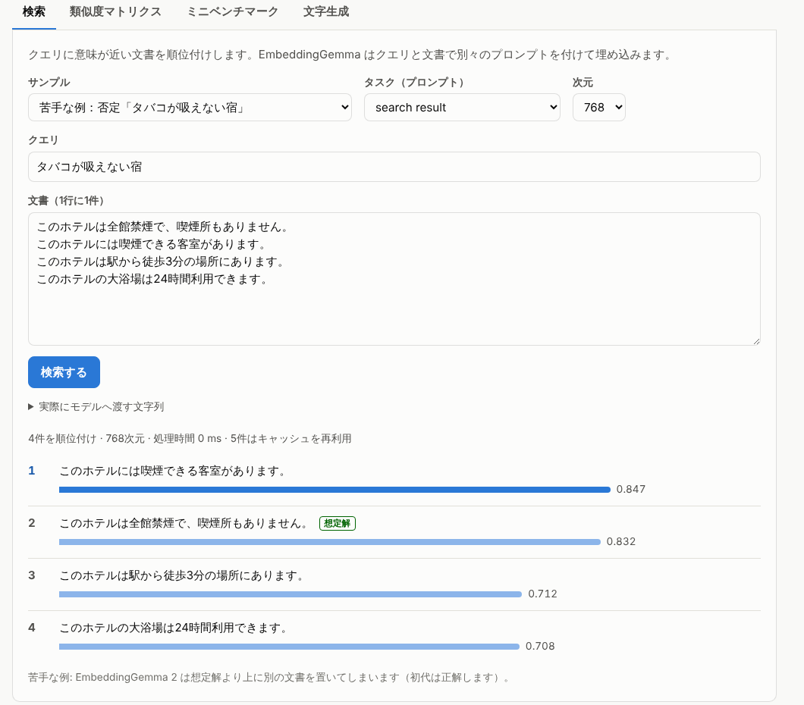

# EmbeddingGemma 2 が失敗するとき（2026-10-08）

EmbeddingGemma 2 がどんなときに間違えるかを、3 つの方法で調べた記録です。

1. **失敗パターン別の問題集**: 否定・数字・向き・相対的な日付など 16 種類の問題を 219 問用意しました。正解の候補がない問題も 18 問あります。
2. **長い文書**: ミニベンチマークで、正解の文書を無関係な文書の中に埋めました。
3. **ブラウザエージェント**: 失敗しやすい手順を含む 7 タスクを、実際のブラウザで動かしました（動画あり）。

環境はこれまでと同じクラウドコンテナ（CPU 4 コア、GPU なし）です。
モデルは [onnx-community/embeddinggemma-2-ONNX](https://huggingface.co/onnx-community/embeddinggemma-2-ONNX)（リビジョン `daa72c5`）のテキストモデルを使いました。
比較のため、初代（EmbeddingGemma 300M）と Liquid AI の判断モデル d1-3B でも同じことをしました。

## 結論: こんなときに失敗する

1. **候補の違いが「否定」「向き・役割」「反対の言葉」だけのとき。**
   正答率は次のとおりです。
   - 役割・向き: 38%（でたらめに選んでも 50%）
   - 否定: 80%
   - 反対の操作: 70%

   どちらを聞いても同じ候補を選んだ組（「違いを無視した組」）もありました。

   | 種類 | 違いを無視した組 |
   | --- | ---: |
   | 否定 | 10 組中 4 組 |
   | 反対の操作 | 10 組中 6 組 |
   | 役割・向き | 7 組中 5 組 |

   - 「タバコが吸える宿」と聞いても「タバコが吸えない宿」と聞いても、「喫煙できる客室があります」を 1 位にしました。
   - 「行き先を名古屋にする」でも「博多に向かう」でも、「到着地」ではなく「出発地」の欄を選びました。

   否定と反対の言葉は初代のほうが強く（95%・85%）、2 で悪くなった点です。
2. **計算や比較が必要なとき。** 結果はでたらめに選んだときとほぼ同じでした。

   | 種類 | 2 の正答率 | でたらめに選んだとき |
   | --- | ---: | ---: |
   | 相対的な日付（明日・先月・来年） | 31% | 31% |
   | 最上級（いちばん安い・古い） | 60% | 33% |
   | 以上・以下 | 70% | 50% |
   | 遠回しな言い方（「寒い」→暖房） | 40% | 40% |

   最上級は、5 組中 4 組で違いを無視しました。
   手順に今日の日付（「今日は2026年10月8日」）を書くと、「先月の注文」でも、その「10月」に引っ張られて「10月の注文」を選びます。
3. **手順と同じ文字を含む不正解があるとき。**
   「文字を多く共有する候補」が 1 つに決まる問題では、誤りの 81%（26 問中 21 問）がその候補を選んでいました。
   例: 「パソコンが立ち上がらない」に対して、次の順にしました。
   - 1 位: 不正解の「パソコンの立ち上がりを速くする設定」（0.857）
   - 2 位: 正解の「電源ボタンを押しても画面が真っ暗なままのときの対処法」（0.757）
4. **正解の候補がないとき。** 必ずどれかを選び、類似度のしきい値でも止められません。
   - 2 の類似度は 0.70〜0.88 に詰まっています（全候補の 10〜90% 点）。エージェントのしきい値 0.3 では、正解のない 18 問を 1 問も止めませんでした。
   - いちばんよいしきい値（0.799）でも、正解のない問題の 83% を止める代わりに、正解のある問題の 32% も止めます。
   - 「該当する操作はない」という候補を足す方法も試しました。止められたのは 18 問中 1〜2 問だけでした。
5. **文書が長く、答えが後ろのほうにあるとき。**
   - 正解の文書の前後に無関係な文書を 3 つ足すだけ（約 110 トークン）で、Top-1 が 98% から下がります。答えが先頭なら 71%、末尾なら 30% です。
   - 30 個足す（約 830 トークン）と、先頭 55%・末尾 14% です。
   - 初代は、3 個ではほぼ同じでした。10 個・30 個では 2 よりさらに落ち、30 個足すと答えが先頭でも 21% でした。
6. **間違えたかどうかを、自信の大きさから見分けにくい。**
   - 1 位と 2 位の差の中央値は、正解のとき 0.030、誤りのとき 0.014 です。初代は 0.077 と 0.012 で、正解と誤りの差がはっきりしていました。
   - 自信の低い 20% を強いモデルに回すと、拾える誤りは 38% です。初代では 52% でした。

**得意なこと**: 次の種類はよくできました。

| 種類 | 正答率 |
| --- | ---: |
| 数字がそのまま書いてある | 100% |
| 名前・略称 | 94% |
| 言い換え | 100% |
| 表記ゆれ・誤字 | 100% |
| 英語のボタン | 88% |
| 2 つの条件の組み合わせ | 81% |

条件を変えても、精度はほとんど落ちませんでした。
- 無関係な候補（UI なら 51 個、文なら 36 個）を足しても、3 ポイントしか下がりません。
- q8 は fp32 と同じで、q4 は 1 ポイント低いだけです。
- 512 次元でも 768 次元と同じでした。

**ブラウザエージェント**: 失敗しやすい手順を含む 7 タスクでは、2 は 1 つしか成功しませんでした（初代 4/7、d1-3B 5/7）。
同じタスクの手順を書き直すと、2 は 7/7 になりました（初代 6/7）。書き直したのは次の点です。
- 画面の言葉を使う
- 否定・比較・書き換えをなくす

EmbeddingGemma 2 に任せてよいのは、画面にある言葉で書いた手順に合う要素を選ぶところまでです。
次の判断は、手順を書く側（Claude などの LLM）が先に済ませておく必要があります。
- 否定
- 比較
- 日付や時刻の計算
- その操作がそもそもページでできるかどうか

## 対策

| 失敗しやすいこと | 手順を書く側がすること | 例 |
| --- | --- | --- |
| 否定 | 押すボタンの名前で書く | 「保存しないで取り消す」→「『キャンセル』を押す」 |
| 向き・役割 | 欄の名前で書く | 「行き先を名古屋にする」→「到着地に『名古屋』と入れる」 |
| 相対的な日付・時刻 | 画面の表記に直す | 「先月」→「2026年9月」、「午後3時」→「15時」 |
| 最上級・比較 | 具体的な値に直す | 「いちばん古い注文」→「2026年7月3日の注文」 |
| 該当なし | ページにその要素があるか、手順を出す前に確かめる | クーポン欄がなければ、その手順を出さない |

ほかの対策は次のとおりです。
- **しきい値は使い回さない。** 2 の類似度は 0.7〜0.9 に詰まっているので、初代向けのしきい値（0.3）は効きません。しきい値を使うなら、2 用に決め直してください。ただし、決め直しても該当なしの判定には向きません（結論 4）。
- **長い文書は短く区切って埋め込む。** 答えが後ろにあるほど見つからないので、大事な情報は先頭に置きます。
- **否定や役割が大事な場面では、判断モデルや LLM で選び直す。**
  d1-3B は、2 が苦手な種類で次の正答率でした。
  - 否定: 100%
  - 反対の操作: 95%
  - 役割・向き: 75%

  ただし CPU では時間がかかります。
  - 候補 2〜8 個: 1 問 2.2 秒
  - エージェントの候補 20 個前後: 5〜11 秒

## 1. 失敗パターン別の問題集

問題は [public/data/failure-probes.json](../public/data/failure-probes.json) にあり、[scripts/failure-probes.mjs](../scripts/failure-probes.mjs) で採点します。

### 作り方

- **候補**: 1 つの組に 2〜8 個あり、違いは 1 か所だけです（否定の有無、数字、向きなど）。
- **手順（質問）**: 候補ごとに、その候補が正解になるものを 1 つずつ用意しました。
  違いを無視するモデルは、どれを聞いても同じ候補を選びます。そのため組の中で 1 問しか当たらず、「違いを無視した組」として数えられます。
- **候補の書き方**: UI の候補はエージェントと同じです（「ボタン『保存して閉じる』を押す」）。文の候補は、短い文と質問です。
- **プロンプト**: エージェントと同じです。手順には `task: search result | query: `、候補には `title: none | text: ` を付けました。
- **「文字の重なりだけ」**: モデルを使わない基準です。手順と共有する 2 文字の組（bigram）が最も多い候補を選びます。
- **正解ラベルの点検**: 別のエージェントに、日本語の自然さ・正解が 1 つに決まるか・事実関係を点検させ、指摘を直しました。
  直したのは、未来の日付だった注文日、「爬虫類は毛が抜けにくい」という不正確な説明、ほかの問題の答えになりうる無関係な候補などです。

### 種類ごとの正答率

「偶然」は、でたらめに選んだときの正答率です。

| 種類（問題数） | 偶然 | 文字の重なりだけ | 2 fp32 | 2 q4 | 初代 fp32 | 初代 q8 | d1-3B | 2 fp32 の「違いを無視」した組 |
| --- | ---: | ---: | ---: | ---: | ---: | ---: | ---: | ---: |
| 否定（20） | 50% | 63% | 80% | 75% | 95% | 95% | 100% | 4/10 |
| 反対の操作（20） | 50% | 57% | 70% | 70% | 85% | 85% | 95% | 6/10 |
| 数字（同じ書き方）（22） | 32% | 100% | 100% | 100% | 100% | 100% | 100% | 0/7 |
| 数字（書き換えが必要）（20） | 30% | 53% | 85% | 90% | 85% | 85% | 95% | 0/6 |
| 以上・以下（10） | 50% | 60% | 70% | 60% | 60% | 60% | 80% | 3/5 |
| 役割・向き（16） | 50% | 47% | 38% | 38% | 31% | 25% | 75% | 5/7 |
| 相対的な日付（13） | 31% | 23% | 31% | 31% | 31% | 31% | 69% | 4/4 |
| 最上級・比較（10） | 33% | 47% | 60% | 60% | 40% | 50% | 80% | 4/5 |
| 2つの条件（16） | 25% | 63% | 81% | 81% | 81% | 81% | 88% | 0/4 |
| 同じ言葉の罠（10） | 47% | 0% | 50% | 60% | 60% | 60% | 100% | – |
| 遠回しな言い方（15） | 40% | 33% | 40% | 40% | 67% | 67% | 93% | 0/6 |
| 似た名前・略称（17） | 35% | 68% | 94% | 94% | 94% | 94% | 94% | 0/6 |
| 記号だけのボタン（8） | 13% | 13% | 75% | 63% | 88% | 88% | 100% | 0/1 |
| 英語の画面（対照）（8） | 25% | 22% | 88% | 88% | 100% | 100% | 100% | 0/2 |
| 言い換え（対照）（9） | 33% | 60% | 100% | 89% | 89% | 100% | 100% | 0/3 |
| 表記ゆれ・誤字（5） | 25% | 85% | 100% | 80% | 100% | 80% | 100% | 0/1 |
| **全体**（219） | 37% | 53% | **73%** | **71%** | **76%** | **76%** | **92%** | 26/77 |

### 間違えた例（2 fp32）

| 種類 | 手順・質問 | 正解（類似度） | 2 が 1 位にした候補（類似度） | 初代 |
| --- | --- | --- | --- | --- |
| 否定 | タバコが吸えない宿 | 全館禁煙で、喫煙所もありません（0.832） | 喫煙できる客室があります（0.847） | 正解 |
| 否定 | 変更を保存してから閉じる | 「保存して閉じる」（0.892） | 「保存せずに閉じる」（0.896） | 正解 |
| 反対の操作 | 地図をズームアウトする | 「縮小」（0.843） | 「拡大」（0.870） | 正解 |
| 反対の操作 | 音を消す | 「ミュート」（0.837） | 「ミュート解除」（0.847） | 正解 |
| 役割・向き | 佐藤さんがお金を受け取った取引 | 田中さんが佐藤さんに送金した（0.828） | 佐藤さんが田中さんに送金した（0.863） | 間違い |
| 役割・向き | 博多に向かう（博多） | 入力欄「到着地」（0.699） | 入力欄「出発地」（0.712） | 間違い |
| 数字の書き換え | 午後3時に始まる会議 | 会議は15時に始まります（0.868） | 会議は13時に始まります（0.876） | 間違い |
| 以上・以下 | 16歳の高校生が申し込むには？ | 18歳未満の方は…（0.755） | 18歳以上の方は…（0.822） | 間違い |
| 相対的な日付 | 今日は木曜日。明日届けてもらう | 10月9日（金）（0.728） | 10月8日（木）（0.740） | 間違い |
| 相対的な日付 | 今日は水曜日。明日出せるごみは？ | 燃えるごみ（月・木）（0.772） | 資源ごみ（水）（0.845） | 間違い |
| 最上級 | いちばん古い注文の領収書を出す | 7月3日の注文（0.779） | 10月2日の注文（0.783） | 正解 |
| 最上級 | この中でいちばん低い山 | 奥穂高岳 3190m（0.643） | 富士山 3776m（0.708） | 間違い |
| 2 つの条件 | 東京から大阪へ9時に出る列車 | 東京発・新大阪行き 9時（0.867） | 新大阪発・東京行き 9時（0.874） | 間違い |
| 同じ言葉の罠 | 退会したい | アカウントを削除する手順（0.787） | 退会した後に再登録する方法（0.835） | 間違い |
| 遠回しな言い方 | 字が小さくて読みにくい | 「文字を大きくする」（0.810） | 「文字を小さくする」（0.836） | 間違い |
| 遠回しな言い方 | 夜に画面がまぶしい | 「ダーク」（0.691） | 「ライト」（0.715） | 正解 |
| 記号だけのボタン | ページを再読み込みする | 「↻」（0.737） | 「🔍」（0.740） | 正解 |
| 英語の画面 | 変更を破棄する | 「Discard」（0.785） | 「Save changes」（0.809） | 正解 |

間違えたときの、正解と 1 位の差は 0.001〜0.1 です。60 問のうち 4 分の 3 は、差が 0.03 以下でした。
2 の類似度は値の幅が狭いので、わずかな差で順位が入れ替わります。

### 違いを無視した組

77 組のうち 26 組で、どの手順を聞いても同じ候補を選びました。主なものは次のとおりです。

| 組 | 聞いた手順 | いつも 1 位にした候補 |
| --- | --- | --- |
| 否定 | 変更を保存してから閉じる／変更を保存しないで閉じる | 「保存せずに閉じる」 |
| 否定 | 飲むと眠くなる薬／飲んでも眠くならない薬 | 眠くなる成分を含まないため、運転前でも飲めます |
| 反対の操作 | 口座にお金を預ける／口座からお金を引き出す | 「出金」 |
| 反対の操作 | 全部にチェックを入れる／チェックを全部外す | 「すべて選択」 |
| 以上・以下 | 2018年に出た本／2023年に出た本 | 「2020年より前」 |
| 役割・向き | 名古屋から乗る／行き先を名古屋にする／博多を出発する／博多に向かう | 入力欄「出発地」 |
| 役割・向き | 旅行に持っていくドルを用意する／余ったドルを日本円に戻す | 「ドルを円に両替」 |
| 相対的な日付 | 今日は2026年10月8日。先々月／先月／今月の注文 | 「2026年10月のご注文」 |
| 相対的な日付 | 今日は木曜日。今日／明日／明後日／来週の月曜日に届けて | 「10月8日（木）」 |
| 最上級 | いちばん高い／いちばん安いイヤホン | MINI ¥3,480 |
| 最上級 | いちばん古い／いちばん新しい注文 | 10月2日の注文 |

相対的な日付の 4 組は、すべて違いを無視していました。手順に書いた今日の日付や曜日と同じ文字を持つ候補を、いつも選んでいます。

### 文字の重なりとの関係

モデルを使わずに文字の重なりだけで選ぶと、全体の正答率は 53% です。2 は 73% で、これを 20 ポイント上回ります。
ただし種類によっては、文字の重なりだけで選ぶ方法とほとんど変わりません。
- 役割・向き: 2 は 38%、文字の重なりだけで 47%
- 相対的な日付: 2 は 31%、文字の重なりだけで 23%
- 遠回しな言い方: 2 は 40%、文字の重なりだけで 33%

| モデル | 誤り | 文字の重なりで 1 位が決まる誤り | うち、その 1 位を選んだ |
| --- | ---: | ---: | ---: |
| 2 fp32 | 60 | 26 | 21（81%） |
| 2 q4 | 63 | 29 | 22（76%） |
| 初代 fp32 | 52 | 25 | 21（84%） |
| 初代 q8 | 52 | 25 | 19（76%） |
| d1-3B | 18 | 9 | 4（44%） |

### 初代との違い

両方が外した 39 問、2 だけが外した 21 問、初代だけが外した 13 問。

- 2 だけ: 否定 4、反対の操作 4、数字（書き換えが必要） 1、以上・以下 1、役割・向き 1、相対的な日付 1、最上級・比較 1、同じ言葉の罠 1、遠回しな言い方 4、記号だけのボタン 2、英語の画面（対照） 1
- 初代だけ: 否定 1、反対の操作 1、数字（書き換えが必要） 1、以上・以下 2、役割・向き 2、相対的な日付 1、最上級・比較 3、記号だけのボタン 1、言い換え（対照） 1
- 両方: 反対の操作 2、数字（書き換えが必要） 2、以上・以下 2、役割・向き 9、相対的な日付 8、最上級・比較 3、2つの条件 3、同じ言葉の罠 4、遠回しな言い方 5、似た名前・略称 1

2 が新たに間違えるようになったのは、主に否定・反対の操作・遠回しな言い方・記号だけのボタンです。
逆に、最上級と以上・以下は 2 のほうが少しよくなりました。ただし、どちらもでたらめに選ぶのとの差は小さいままです。

## 2. 正解の候補がないとき

| モデル | 1 位の類似度（正解あり, 中央値） | 1 位の類似度（該当なし, 中央値） | AUC | しきい値 0.3 で止まる（該当なし / 正解あり） | 最良のしきい値 | そのとき止まる（該当なし / 正解あり） |
| --- | ---: | ---: | ---: | ---: | ---: | ---: |
| 2 fp32 | 0.838 | 0.770 | 0.78 | 0/18 / 0/219 | 0.799 | 83% / 32% |
| 2 q8 | 0.837 | 0.770 | 0.78 | 0/18 / 0/219 | 0.796 | 83% / 31% |
| 2 q4 | 0.835 | 0.770 | 0.76 | 0/18 / 0/219 | 0.794 | 78% / 31% |
| 初代 fp32 | 0.532 | 0.371 | 0.83 | 6/18 / 20/219 | 0.454 | 89% / 29% |
| 初代 q8 | 0.535 | 0.367 | 0.83 | 6/18 / 18/219 | 0.455 | 89% / 29% |
| 初代 q4 | 0.544 | 0.395 | 0.83 | 6/18 / 14/219 | 0.456 | 83% / 25% |
| d1-3B | 0.967 | 0.748 | 0.86 | – | 0.911 | 89% / 24% |

- 2 では、正解のある問題の 1 位の類似度（中央値 0.838）と、正解のない問題の 1 位（0.770）が近く、分けられません。
- 初代向けのしきい値 0.3 は、2 では一度も働きません。
- 初代でも、0.3 は正解のない 18 問のうち 6 問しか止めず、正解のある 219 問のうち 20 問を止めてしまいます。

「該当する操作はない」「この中に合う文書はない」という候補を足す方法も試しました。
- 2: 正解のない 18 問のうち、止められたのは 1〜2 問です。正解のある問題では、5〜10 問でその候補が 1 位になりました。
- 初代: 止められたのは 0〜2 問です。

## 3. 自信の低い判断を強いモデルに回す

1 位と 2 位の差が小さい判断ほど誤りやすいので、差の小さい順に一定の割合を強いモデルに回し、そのモデルは正しく答えるものとして計算しました。

| モデル | 誤りの数 | 自信と正誤の AUC | 10% を回す | 20% を回す | 30% を回す | 50% を回す |
| --- | ---: | ---: | ---: | ---: | ---: | ---: |
| 2 fp32 | 60 | 0.70 | 誤りの 18%（正答率 78%） | 誤りの 38%（正答率 83%） | 誤りの 48%（正答率 86%） | 誤りの 72%（正答率 92%） |
| 2 q4 | 63 | 0.71 | 誤りの 21%（正答率 77%） | 誤りの 40%（正答率 83%） | 誤りの 54%（正答率 87%） | 誤りの 70%（正答率 91%） |
| 初代 fp32 | 52 | 0.78 | 誤りの 35%（正答率 84%） | 誤りの 52%（正答率 89%） | 誤りの 62%（正答率 91%） | 誤りの 79%（正答率 95%） |
| 初代 q8 | 52 | 0.77 | 誤りの 33%（正答率 84%） | 誤りの 52%（正答率 89%） | 誤りの 62%（正答率 91%） | 誤りの 79%（正答率 95%） |
| d1-3B | 18 | 0.92 | 誤りの 72%（正答率 98%） | 誤りの 83%（正答率 99%） | 誤りの 89%（正答率 99%） | 誤りの 100%（正答率 100%） |

2 は、正解のときも 1 位と 2 位の差が小さい（中央値 0.030、初代は 0.077）ので、自信の大きさで誤りを見分けにくくなっています。
自信と正誤の AUC は 0.70 です（初代は 0.78）。

## 4. 長い文書

[scripts/long-text.mjs](../scripts/long-text.mjs) を使い、ミニベンチマークの 56 問で調べました。
- 各問の正解の文書を、別の話題の文書 k 個の中に埋めました。置く場所は、先頭・中央・末尾の 3 通りです。
- 埋めた文書は、元のままの文書と並べて順位を付けました。元のままの文書には、同じ話題の紛らわしい文書も含まれます。
- 足した文書は 1 つ 25〜30 トークンです。

| 足した文書（位置） | トークン数（平均） | 初代 fp32 | 2 fp32 |
| --- | ---: | ---: | ---: |
| なし | 34 | 96% | 98% |
| 3 件（正解は先頭） | 114 | 77% | 71% |
| 3 件（正解は中央） | 114 | 38% | 41% |
| 3 件（正解は末尾） | 114 | 32% | 30% |
| 10 件（正解は先頭） | 302 | 46% | 54% |
| 10 件（正解は中央） | 302 | 4% | 16% |
| 10 件（正解は末尾） | 302 | 5% | 11% |
| 30 件（正解は先頭） | 835 | 21% | 55% |
| 30 件（正解は中央） | 835 | 0% | 7% |
| 30 件（正解は末尾） | 835 | 0% | 14% |

- 2 は答えが先頭にあれば、30 個足しても半分以上は 1 位を保ちます。しかし答えが中央や末尾にあると、ほとんど見つかりません。
- 3 件では初代と 2 はほぼ同じですが、10 件・30 件では初代のほうが大きく落ちます。長い文書には 2 のほうが強い結果でした。
- どちらも文書全体の平均で 1 つのベクトルを作るので、関係のない部分が増えるほど薄まります。
- どちらも答えが先頭にあるほうがずっと見つかりやすく、文書の最初のほうを重く見ているようです。

## 5. プロンプト・次元・量子化・候補の数

| モデル | 検索（エージェントと同じ） | 質問応答 | 文の類似度（両側） | プロンプトなし |
| --- | ---: | ---: | ---: | ---: |
| 2 fp32 | 73% | 74% | 70% | 68% |
| 初代 fp32 | 76% | 76% | 77% | 77% |

| 2 fp32 のプロンプト | 否定 | 反対の操作 | 役割・向き | 相対的な日付 | 遠回しな言い方 | 同じ言葉の罠 |
| --- | ---: | ---: | ---: | ---: | ---: | ---: |
| 検索（エージェントと同じ） | 80% | 70% | 38% | 31% | 40% | 50% |
| 質問応答 | 80% | 75% | 38% | 31% | 40% | 60% |
| 文の類似度（両側） | 85% | 70% | 31% | 23% | 27% | 50% |
| プロンプトなし | 75% | 80% | 31% | 31% | 40% | 40% |

| モデル | 768 次元 | 512 | 256 | 128 | 無関係な候補 +10 | 無関係な候補 +全部（UI 51 / 文 36） |
| --- | ---: | ---: | ---: | ---: | ---: | ---: |
| 2 fp32 | 73% | 73% | 70% | 67% | 70% | 69% |
| 2 q8 | 73% | 73% | 70% | 68% | 70% | 69% |
| 2 q4 | 71% | 72% | 70% | 67% | 69% | 69% |
| 初代 fp32 | 76% | 77% | 78% | 77% | 74% | 74% |
| 初代 q8 | 76% | 75% | 77% | 74% | 74% | 74% |
| 初代 q4 | 77% | 78% | 78% | 74% | 75% | 74% |

- プロンプトを付けないと 5 ポイント下がります（73% → 68%）。「質問応答」のプロンプトはエージェントの「検索」とほぼ同じです。
- 512 次元までは 768 次元と同じで、128 次元で 6 ポイント下がります。
- q8 は fp32 とまったく同じ正答率、q4 は 1〜2 ポイント低い程度です。
- 無関係な候補（会社概要・採用情報などのリンクや、関係のない短い文）を足しても、ほとんど下がりません。失敗の原因は候補の数ではなく、似た候補があることです。

## 6. ブラウザエージェントで試す

これまでのブラウザエージェント（手順は私が書き、EmbeddingGemma が各手順で操作する要素を選ぶ）に、失敗しやすい手順を含む 7 タスクを追加しました（`npm run agent -- --hard`）。
- 経路検索の模擬サイト（のりかえナビ）を新しく作りました。
- 通販サイトのトップには、`?banner=1` を付けたときだけ「×」で閉じるお知らせを出すようにしました。元の 6 タスクの画面は変わりません。

| タスク | 失敗しやすい点 | 手順（要点） | 2 | 初代 | d1-3B | 2（書き直した手順） | 初代（書き直した手順） |
| --- | --- | --- | :---: | :---: | :---: | :---: | :---: |
| hard-cancel | 否定 | 変更を保存しないで取り消す | ✗ | ✗ | ✓ | ✓ | ✓ |
| hard-push-only | 否定（〜はそのまま） | メール通知はそのままにして、プッシュ通知だけを止める | ✗ | ✓ | ✓ | ✓ | ✓ |
| hard-sort | 反対の意味（言い換え） | 値段が張るものから順に並べる | ✓ | ✓ | ✓ | ✓ | ✓ |
| hard-route | 向き・時刻の書き換え | 行き先を「名古屋」に／出発する駅を「博多」に／午後3時 | ✗ | ✗ | ✗ | ✓ | ✗ |
| hard-oldest | 最上級 | いちばん古い注文の領収書を出す | ✗ | ✓ | ✓ | ✓ | ✓ |
| hard-icon | 記号だけのボタン | タイムセールのお知らせを閉じる | ✗ | ✗ | ✓ | ✓ | ✓ |
| hard-missing | できない手順 | クーポンコードの入力欄に「AUTUMN10」と入れる | ✗ | ✓ | ✗ | ✓ | ✓ |
| **合計** | | | **1/7** | **4/7** | **5/7** | **7/7** | **6/7** |

「書き直した手順」は、ページを見た計画役が書くような手順です（`npm run agent -- --hard --plain`）。
- 例: 「『キャンセル』を押す」「到着地に『名古屋』と入れる」「出発時刻を『15時』にする」「2026年7月3日の注文の領収書を発行する」「お知らせの『×』ボタンを押す」
- hard-missing は、計画役がクーポン欄のないことに気づき、手順を出さない想定です。

2 がどう間違えたかは、次のとおりです（類似度は 1 位、2 位の順）。

| タスク | 手順 | 2 の選択 | 本来の操作 |
| --- | --- | --- | --- |
| hard-cancel | 変更を保存しないで取り消す | 「変更を保存」を押した（0.871） | 「キャンセル」（0.796） |
| hard-push-only | メール通知はそのままにして、プッシュ通知だけを止める | 「メール通知」をオフにした（0.823） | 「プッシュ通知」（0.810） |
| hard-route | 行き先を「名古屋」にする | 「出発地」に名古屋と入れた（0.714） | 「到着地」（0.706） |
| hard-oldest | いちばん古い注文の領収書を出す | 10月2日の注文（0.783） | 7月3日の注文（0.779） |
| hard-icon | タイムセールのお知らせを閉じる | メニューの「タイムセール」リンクを開いた（0.854） | お知らせの「×」（0.799） |
| hard-missing | クーポンコードの入力欄に「AUTUMN10」と入れる | 商品検索の欄に AUTUMN10 と入れた（0.713） | 何もしない |

hard-route の失敗は、1 つめの手順だけでは終わりませんでした。
1. 「出発地」に名古屋と入れました。
2. 次の「出発する駅を『博多』にする」で、2 は正しく「出発地」を選びました。しかし、その欄は 1 つめの手順で入力済みです。同じ欄に 2 回入力しない決まりなので、何もせず次に進みました。
3. 結果は、出発地が名古屋で到着地が空のまま検索しています。

一方、「午後3時」は 2 が「15時」を選べました。初代は「13時」を選んでいます。
初代は、書き直した手順でも hard-route に失敗しました。原因は、「出発地に『博多』と入れる」で「到着地（いまの値『名古屋』）」を選んだことです。候補に付いた「いまの値」に引っ張られました。

hard-missing で初代が成功したのは、類似度がしきい値 0.3 をわずかに下回ったからです（0.2995）。2 の類似度は 0.713 で、止まりませんでした。

### 動画

- `test-output/agent/videos/h01-hard-cancel-script-embedding-v2-hard.mp4` など（`npm run agent -- --hard --embedding v2 --video`）
- 失敗した 4 タスクと、書き直した手順で成功した hard-cancel をつないだ動画も作りました（`failures-v2.mp4`）。
- 右のパネルの候補の数字は、EmbeddingGemma のときはコサイン類似度です。これまでの動画は、それを確率に直した値でした。
- 「正しい動き」の欄に、本来の操作を表示します。

## 7. 初代・d1-3B との比較

### 初代

- 全体の正答率は 76% で、2 の 73% より少し上でした。否定・反対の操作・遠回しな言い方・記号だけのボタンで 2 より強い結果です。
- 類似度の幅が広く（全候補の 10〜90% 点で 0.19〜0.63）、正解のときは 1 位と 2 位の差も大きくなります。そのため、しきい値や自信の大きさで誤りを見分けやすくなっています。
- 長い文書には 2 より弱い結果でした。

### d1-3B

d1-3B は、候補をまとめて読み、比べてから答えます。
- **正答率**: 全体で 92% でした。
  - 否定: 100%
  - 反対の操作: 95%
  - 同じ言葉の罠: 100%
  - 遠回しな言い方: 93%
- **違いを無視した組**: 77 組中 6 組だけでした（2 は 26 組）。違いが 1 か所だけの組に強い結果です。
- **間違えた種類**: 次の種類は間違えます。
  - 相対的な日付: 69%
  - 役割・向き: 75%
  - 最上級: 80%
  - 以上・以下: 80%
- **間違えた例**:
  - 「今日は2026年10月8日。先々月の注文」で「9月の注文」を選びました。
  - 「午後3時に始まる会議」で「13時」を選びました。
  - 「佐藤さんがお金を受け取った取引」で、佐藤さんが送金した取引を選びました。
- **自信と正誤**: 確率の差と正誤がよく対応します（AUC 0.92）。確率の差が小さい 10% を回すだけで、誤りの 72% を拾えます。
- **速さ**: CPU では、候補 2〜8 個で 1 問 2.2 秒、エージェントの候補 20 個前後で 5〜11 秒でした。EmbeddingGemma は 0.1 秒前後です。
- **ブラウザ操作の 7 タスク**: 5/7 でした。失敗は次の 2 つです。
  - hard-route: 「午後3時」で「13時」を選びました。
  - hard-missing: 入力欄の候補が 1 つしかなく、断る方法がありませんでした（選択式の質問なので、候補が 1 つなら必ずそれを選びます）。

## 再現方法

```bash
cd embeddinggemma-demo
npm run download-model -- --model v2 fp32 q8 q4   # EmbeddingGemma 2（初代は --model v1）
npm run failure-probes -- --model v2 --dtype fp32,q8,q4 --prompts all
npm run failure-probes -- --model v1 --dtype fp32,q8,q4
LLAMA_SERVER=/path/to/llama-server npm run failure-probes -- --decider d1-3b   # 任意（agent/llama.mjs）
npm run long-text -- --model v2 && npm run long-text -- --model v1
node scripts/failure-report.mjs                # 上の表（Markdown）
npm run agent -- --hard --embedding v2         # ブラウザエージェント（--plain で書き直した手順、--video で録画）
```

デモの検索タブには、2 が間違える例を「苦手な例」として 7 つ入れました（[public/data/presets.js](../public/data/presets.js)）。
- 想定解に「想定解」のバッジが付くので、それが 1 位でないことを確かめられます。
- 否定と向きの 2 つは、初代では正解します。
- ブラウザ（WASM）で 2 の fp32 と初代の q8 を動かした E2E でも、Node と同じ順位になりました（2 は 7 つすべてで想定解が 2 位以下、初代は否定と向きが 1 位）。



## 注意点

- **問題の数**: 問題は私が作った 219 問です。1 つの種類は 5〜22 問しかなく、1 問の違いで 5〜20 ポイント動きます。種類の間の大きな差（38% と 100% など）は確かですが、70% と 80% の差は誤差の範囲です。
- **問題の作り方**: わざと難しい組を作っています。この正答率は、ふつうの検索の精度ではありません（ふつうの検索に近いミニベンチマークでは、2 は 98% でした）。
- **言語**: 日本語が中心です（英語は対照の 2 組と、数字の書き換えの 1 組だけ）。
- **候補の書き方**: UI の候補の書き方（「ボタン『…』を押す」）は、このエージェントのものです。書き方が変われば、結果も変わりえます。
- **d1-3B**: llama.cpp の CPU 版（Q8_0）で、同じ問題を選択式の質問として解かせました。
