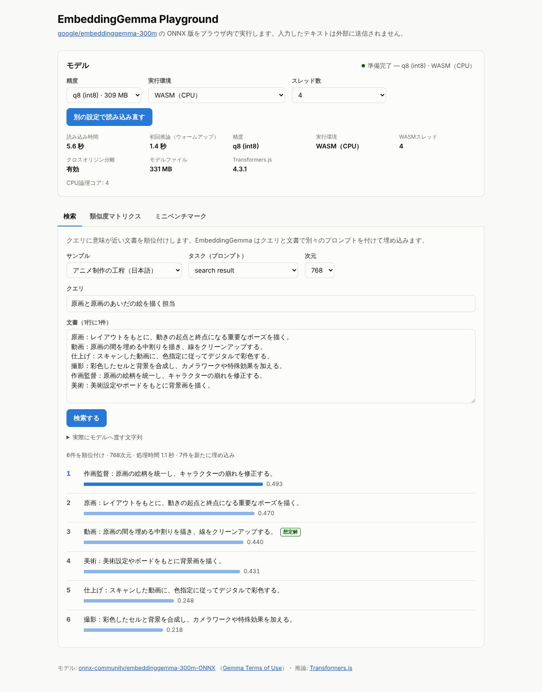
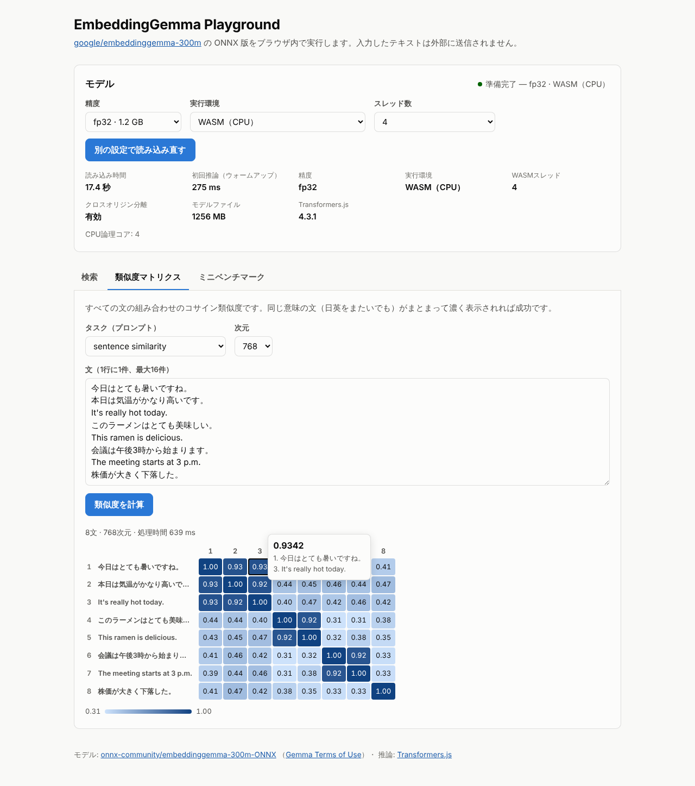
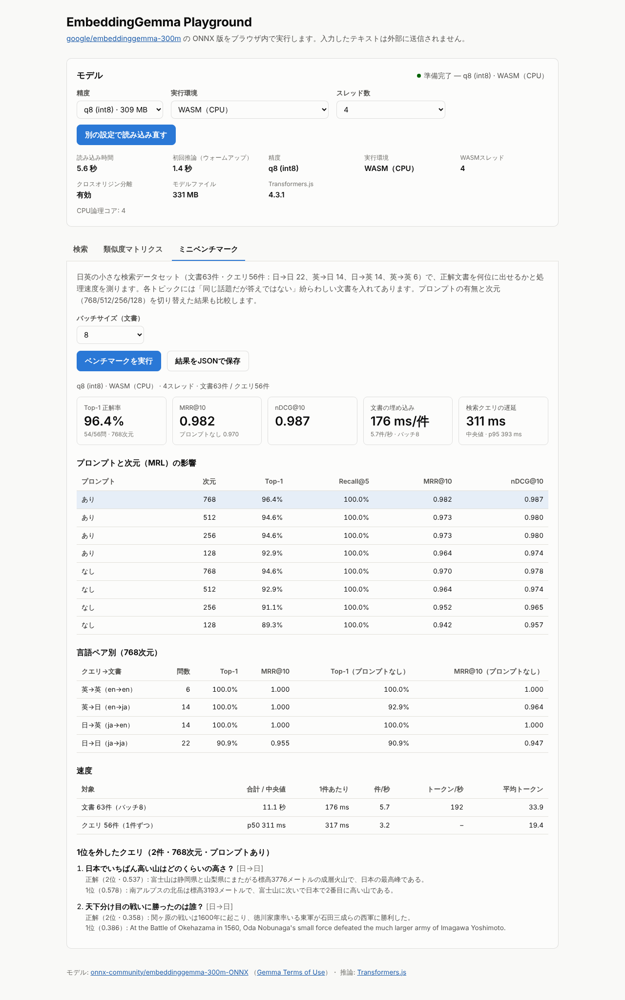
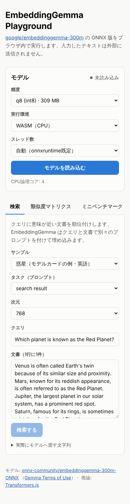

# EmbeddingGemma ブラウザ検証結果（2026-10-07）

Playwright で `DTYPES=fp32,q8,q4 THREADS=4 npm run test:e2e` を実行し、`npm run report` で集計した結果です。
E2E は 20 項目すべて成功しました（Hub から直接読み込む `REMOTE=1` の項目は別途実行して成功）。

- 環境: クラウドコンテナ（CPU 4 コア、GPU なし）上のヘッドレス Chromium 141、WASM 4 スレッド、crossOriginIsolated
- モデル: onnx-community/embeddinggemma-300m-ONNX @ 5090578（ローカルの `/models/` から配信）、Transformers.js 4.3.1
- データ: このデモ用に作った日英ミニデータセット（文書 63 件・クエリ 56 件）。1 問 = 1.8 ポイントなので、1〜2 問の差は誤差の範囲です

## 結論

1. **実装は正しく動いている。** fp32 はモデルカードの例のスコアを小数 4 桁まで再現（最大誤差 0.0000）。q8 は 0.005、q4 は 0.032 のずれで、順位はすべて同じ。
2. **日英の検索精度は高い。** 768 次元・プロンプトありで Top-1 96.4%（54/56）、MRR@10 0.982（fp32・q8）。日→英・英→日のクロスリンガル検索は 28 問すべて 1 位。
3. **外したのは知識や言い換えが要る日本語の質問。** 「日本でいちばん高い山はどのくらいの高さ？」で北岳（日本で 2 番目）を、「天下分け目の戦い」で桶狭間を 1 位にした（正解はどちらも 2 位）。
4. **専門用語の区別は苦手。** サンプル「原画と原画のあいだの絵を描く担当」では、全精度で作画監督 → 原画 → 動画（正解）の順になった。業務用語の検索に使うなら、全文検索との併用や実データでの確認が必要。
5. **プロンプトは付けたほうがよい。** 差は小さいが、全精度・全次元で MRR@10 が「あり」のほうが高い（768 次元で 0.970 → 0.982）。
6. **MRL で次元を減らしても大きくは落ちない。** 768 → 256 次元で Top-1 が 1 問分（96.4% → 94.6%）、128 次元で 2〜3 問分落ちる程度。
7. **WASM（CPU）では fp32 が最速、量子化はダウンロードを小さくするだけ。** クエリ 1 件の中央値は fp32 143 ms、q8 311 ms、q4 669 ms。精度は fp32 ≒ q8 > q4。ブラウザ配布なら q8（331 MB）が無難、速度優先で 1.26 GB を許容できるなら fp32。q4 は WASM では遅く精度も少し落ちる。

## まとめ（768次元・プロンプトあり）

| 精度 | モデル | 読み込み | 初回推論 | Top-1 | MRR@10 | nDCG@10 | 文書 ms/件（バッチ8） | クエリ p50 / p95 |
| --- | ---: | ---: | ---: | ---: | ---: | ---: | ---: | ---: |
| fp32 | 1256 MB | 17.4 s | 275 ms | 96.4%（54/56） | 0.982 | 0.987 | 156 | 143 / 293 ms |
| q8 | 331 MB | 5.6 s | 1.4 s | 96.4%（54/56） | 0.982 | 0.987 | 176 | 311 / 393 ms |
| q4 | 217 MB | 5.1 s | 2.2 s | 94.6%（53/56） | 0.973 | 0.980 | 459 | 669 / 812 ms |

読み込み時間はローカルサーバーから読んだ場合の値です（Hub からのダウンロード時間は含みません）。
精度の指標は再実行しても同じ値になります。速度は実行ごとに 1 割ほどぶれます（同じコードでの再実行ではクエリ p50 が fp32 144 ms / q8 323 ms / q4 711 ms）。
`local=0` で Hub から直接読み込む経路（q4、約 220 MB）も `REMOTE=1` の E2E で別途成功を確認しました。

## プロンプトと次元（MRL）: Top-1 / MRR@10

| 精度 | プロンプト | 768次元 | 512次元 | 256次元 | 128次元 |
| --- | ---: | ---: | ---: | ---: | ---: |
| fp32 | あり | 96.4% / 0.982 | 94.6% / 0.973 | 94.6% / 0.973 | 91.1% / 0.955 |
| fp32 | なし | 94.6% / 0.970 | 92.9% / 0.964 | 91.1% / 0.952 | 89.3% / 0.942 |
| q8 | あり | 96.4% / 0.982 | 94.6% / 0.973 | 94.6% / 0.973 | 92.9% / 0.964 |
| q8 | なし | 94.6% / 0.970 | 92.9% / 0.964 | 91.1% / 0.952 | 89.3% / 0.942 |
| q4 | あり | 94.6% / 0.973 | 94.6% / 0.973 | 94.6% / 0.973 | 92.9% / 0.964 |
| q4 | なし | 94.6% / 0.970 | 91.1% / 0.955 | 91.1% / 0.952 | 89.3% / 0.946 |

## 言語ペア別 Top-1（768次元・プロンプトあり）

| 精度 | 日→日（22問） | 英→日（14問） | 日→英（14問） | 英→英（6問） |
| --- | ---: | ---: | ---: | ---: |
| fp32 | 90.9% | 100.0% | 100.0% | 100.0% |
| q8 | 90.9% | 100.0% | 100.0% | 100.0% |
| q4 | 86.4% | 100.0% | 100.0% | 100.0% |

## モデルカードの例（Which planet is known as the Red Planet?）

|  | Venus | Mars | Jupiter | Saturn | 最大誤差 |
| --- | ---: | ---: | ---: | ---: | ---: |
| モデルカード（fp32） | 0.301 | 0.636 | 0.493 | 0.489 | – |
| fp32 | 0.301 | 0.636 | 0.493 | 0.489 | 0.0000 |
| q8 | 0.305 | 0.636 | 0.496 | 0.494 | 0.0049 |
| q4 | 0.333 | 0.637 | 0.513 | 0.508 | 0.0315 |

## 類似度マトリクス（日英の言い換え8文）

| 精度 | 同じ意味の組の最小値 | 違う意味の組の最大値 | 差 |
| --- | ---: | ---: | ---: |
| fp32 | 0.916 | 0.471 | 0.445 |
| q8 | 0.915 | 0.469 | 0.446 |
| q4 | 0.907 | 0.491 | 0.416 |

## サンプル検索で想定解が何位だったか

| 精度 | ECサイトFAQ（日本語） | 猫と玉ねぎ（日→英） | アニメ制作の工程（日本語） |
| --- | ---: | ---: | ---: |
| fp32 | 1位 | 1位 | 3位 |
| q8 | 1位 | 1位 | 3位 |
| q4 | 1位 | 1位 | 3位 |

## 1位を外したクエリ（768次元・プロンプトあり）

### fp32（2件）

- 「日本でいちばん高い山はどのくらいの高さ？」[ja→ja] 正解 `mt-fuji-height` は2位（0.537）、1位は `mt-kitadake`（0.575）
- 「天下分け目の戦いに勝ったのは誰？」[ja→ja] 正解 `hist-sekigahara` は2位（0.352）、1位は `hist-okehazama`（0.377）

### q8（2件）

- 「日本でいちばん高い山はどのくらいの高さ？」[ja→ja] 正解 `mt-fuji-height` は2位（0.537）、1位は `mt-kitadake`（0.578）
- 「天下分け目の戦いに勝ったのは誰？」[ja→ja] 正解 `hist-sekigahara` は2位（0.358）、1位は `hist-okehazama`（0.386）

### q4（3件）

- 「日本でいちばん高い山はどのくらいの高さ？」[ja→ja] 正解 `mt-fuji-height` は2位（0.558）、1位は `mt-kitadake`（0.579）
- 「真夏に外で倒れないための対策」[ja→ja] 正解 `health-heatstroke` は2位（0.468）、1位は `pet-dog-walk`（0.478）
- 「天下分け目の戦いに勝ったのは誰？」[ja→ja] 正解 `hist-sekigahara` は2位（0.385）、1位は `hist-okehazama`（0.411）

## スクリーンショット

| | |
| --- | --- |
| 検索（fp32、モデルカードの値と並べて表示） |  |
| 専門用語の外れ（q8、想定解が3位） |  |
| 類似度マトリクス（fp32） |  |
| ミニベンチマーク（q8） |  |
| スマホ幅（390px） |  |

## 再現方法

```bash
npm install && npx playwright install chromium
npm run download-model -- fp32 q8 q4
DTYPES=fp32,q8,q4 THREADS=4 npm run test:e2e
npm run report   # test-output/REPORT.md
```

速度はマシンに強く依存します。手元の PC（特に WebGPU 対応ブラウザ）では大きく変わるはずなので、デモ画面のミニベンチマークで測り直してください。
